Airnow Media SDK: mediation AdMob
======
##### Step 1 – Adding Airnow Media SDK
Read the integration guide [here](https://github.com/airnowplatform/airnow-android-sdk/tree/main/airnow-sdk).
##### For ProGuard Users Only
If you are using ProGuard with the Airnow Media SDK, you must add the following code to your ProGuard file:
``` java
-keep class com.airnow.** {*;}
-keep public class com.google.android.gms.ads.** {
   public *;
}
-keep public class com.google.ads.mediation.** {
   public *;
}

-keepattributes JavascriptInterface
-keepclassmembers class * {
    @android.webkit.JavascriptInterface <methods>;
}
```
##### Step 2 – Adding AdMob adapters
1. Copy the library `AirnowSdk-AdMob-Adapter.jar` to your project in the folder `libs`.
2. Then add the following to the dependencies section:
```gradle
implementation files('libs/AirnowSdk-AdMob-Adapter.jar')
```
#### Step 3 - Integrate the Google Mobile Ads SDK into your project
Read the integration guide [here](https://developers.google.com/admob/android/quick-start).

##### Step 4 – Adding mediation
1. Click the **Mediation** tab within AdMob:

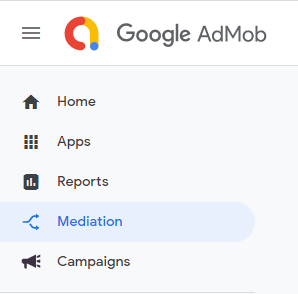

2. Then click the **CREATE MEDIATION GROUP** button:

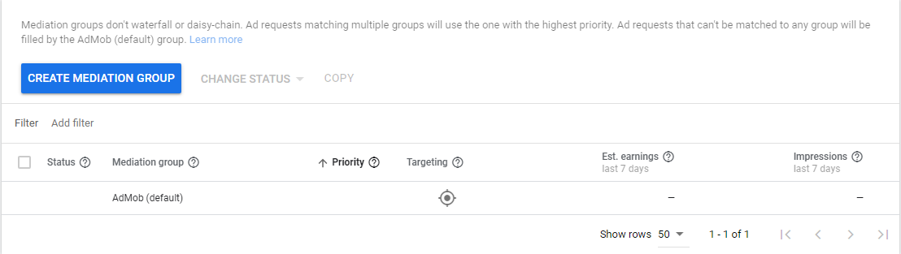

### Banner
1. Select the **Banner** ad format, along with **Android Platform**:

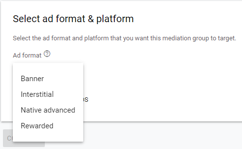
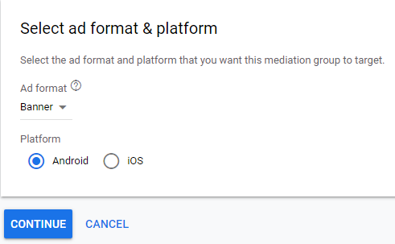

2. Select the **ad unit**: 

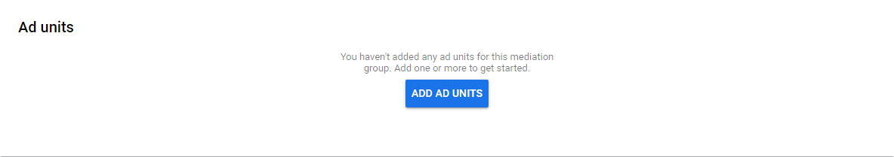
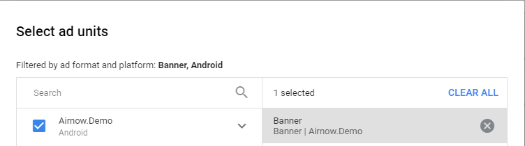

3. Select the **Custom event** in the Ad sources:

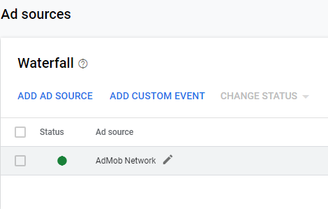


4. Then you will see a window with fields to input:
- Enter **com.google.ads.mediation.airnow.AirnowAdapter** to the **Class Name**
- **Optional**: fill in the **Parameter** field with your apiKey, appId (for initializing the Airnow Media SDK on the first ad request) and placement for your banner in the following format: `{"apiKey": "xxxxx", "appId": "xxxxx", "placementName": "xxxxx"}`. You can initialize the SDK separately by calling `AirnowSdk.init (context, apiKey, appId)`. In this case use the format: `{"placementName": "xxxxx"}` or leave this field blank if you do not use placement for your banner.


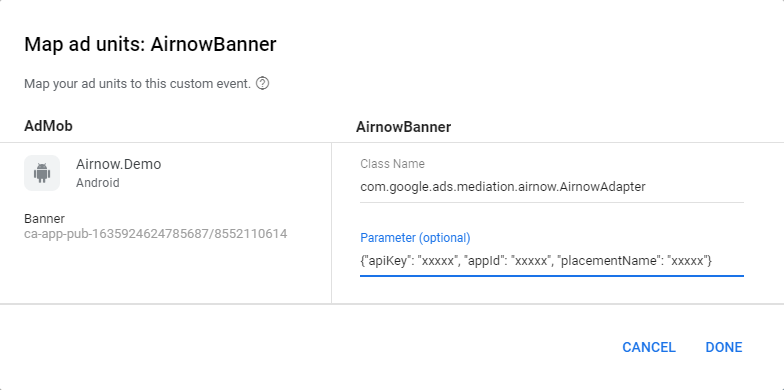

5. Integrate banner ads from Google AdMob into your project
Read the integration guide [here](https://developers.google.com/admob/android/banner).

### Interstitial
1. Select the **Interstitial** ad format, along with **Android Platform**:


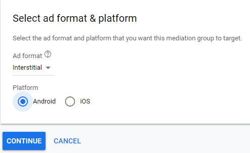

2. Select the **ad unit**: 


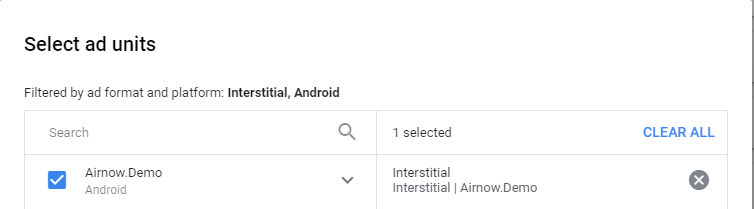

3. Select the **Custom event** in the Ad sources:

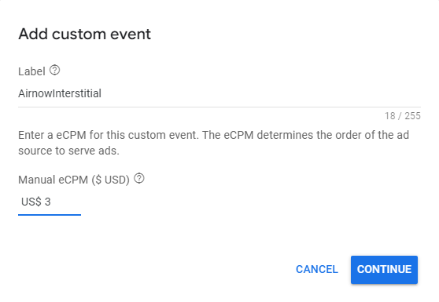

4. Then you will see a window with fields to input:
- Enter **com.google.ads.mediation.airnow.AirnowAdapter** to the **Class Name**
- **Optional**: fill in the **Parameter** field with your apiKey, appId (for initializing the Airnow Media SDK on the first ad request) and placement for your interstitial ads in the following format: `{"apiKey": "xxxxx", "appId": "xxxxx", "placementName": "xxxxx"}`. You can initialize the SDK separately by calling `AirnowSdk.init (context, apiKey, appId)`. In this case use the format: `{"placementName": "xxxxx"}` or leave this field blank if you do not use placement for your interstitial ads.

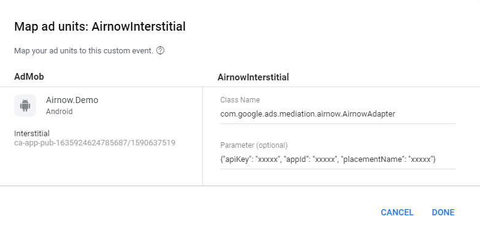

5. Integrate interstitial ads from Google AdMob into your project
Read the integration guide [here](https://developers.google.com/admob/android/interstitial).

### Rewarded
1. Select the **Rewarded** ad format, along with **Android Platform**:


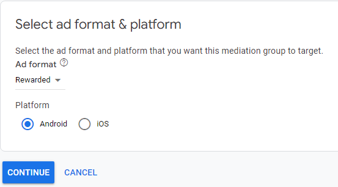

2. Select the **ad unit**: 


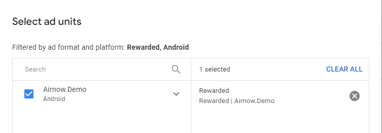

3. Select the **Custom event** in the Ad sources:


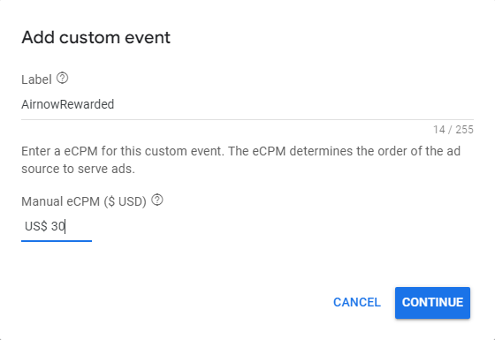

4. Then you will see a window with fields to input:
- Enter com.google.ads.mediation.airnow.AirnowMediationAdapter to the Class Name
- Fill in the Parameter field with your apiKey, appId (for initializing the Airnow Media SDK on the first ad request) and placement for your rewarded ads in the following format: {`"apiKey": "xxxxx", "appId": "xxxxx", "placementName": "xxxxx"}`. You can initialize the SDK separately by calling `AirnowSdk.init (context, apiKey, appId)`. In this case use the format: `{"placementName": "xxxxx"}`.

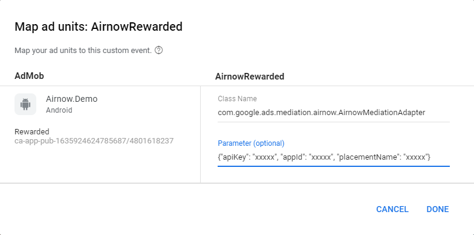

5. The Airnow Media adapter supports an additional request parameter `userId` which can be passed to the adapter using the `AirnowBundleBuilder` class. This class includes the following method:

``` java
setUserId(string)
```
Here's a code example of how to set this ad request parameter:
``` java
Bundle extras  = new AirnowBundleBuilder()
    .setUserId("demo_user_id")
    .build();

AdRequest adRequest = new AdRequest.Builder()
    .addNetworkExtrasBundle(AirnowMediationAdapter.class, extras)
    .build();
```
6. Integrate rewarded ads from Google AdMob into your project

Read the integration guide [here](https://developers.google.com/admob/android/rewarded).